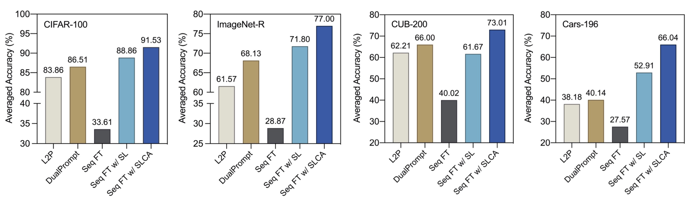

<div align="center">
  
  <div>
  <h1>SLCA: Slow Learner with Classifier Alignment for Continual Learning on a Pre-trained Model</h1>
  </div>

  <div>
      Gengwei Zhang*&emsp; Liyuan Wang*&emsp; Guoliang Kang&emsp; Ling Chen&emsp; Yunchao Wei
  </div>
  <br/>

</div>


PyTorch code for ICCV 2023 paper "[SLCA: Slow Learner with Classifier Alignment for Continual Learning on a Pre-trained Model](https://arxiv.org/abs/2303.05118)".



In this work, we present an extensive analysis for continual learning on a pre-trained model (CLPM), and attribute the key challenge to a progressive overfitting problem. 
Observing that selectively reducing the learning rate can almost resolve this issue in the representation layer, we propose a simple but extremely effective approach named 
**Slow Learner with Classifier Alignment (SLCA)**, 
which further improves the classification layer by modelling the class-wise distributions 
and aligning the classification layers in a post-hoc fashion. 
Across a variety of scenarios, our proposal provides substantial improvements for CLPM 
(e.g., up to 49.76%, 50.05%, 44.69% and 40.16% on Split CIFAR-100, Split ImageNet-R, Split CUB-200 and Split Cars-196, respectively), 
and thus outperforms state-of-the-art approaches by a large margin. Based on such a strong baseline, 
critical factors and promising directions are analyzed in-depth to facilitate subsequent research.

## Requirement
1. torch==1.12.0  
2. torchvision==0.13.0  
3. timm==0.5.4  
4. tqdm  
5. numpy  
6. scipy  
7. quadprog  
8. POT  

## Pre-trained Models
Please download pre-trained ViT-Base models from [MoCo v3](https://drive.google.com/file/d/1bshDu4jEKztZZvwpTVXSAuCsDoXwCkfy/view?usp=share_link) and [ImaegNet-21K](https://drive.google.com/file/d/1PcAOf0tJYs1FVDpj-7lrkSuwXTJXVmuk/view?usp=share_link) and then put or link the pre-trained models to ```SLCA/pretrained```

## Acknolegment
This repo is heavily based on [PyCIL](https://github.com/G-U-N/PyCIL), many thanks.

## Citation

If you find our codes or paper useful, please consider giving us a star or cite with:
```
@article{zhang2023slca,
  title={SLCA: Slow Learner with Classifier Alignment for Continual Learning on a Pre-trained Model},
  author={Zhang, Gengwei and Wang, Liyuan and Kang, Guoliang and Chen, Ling and Wei, Yunchao},
  journal={International Conference on Computer Vision (ICCV)},
  year={2023}
}
```

